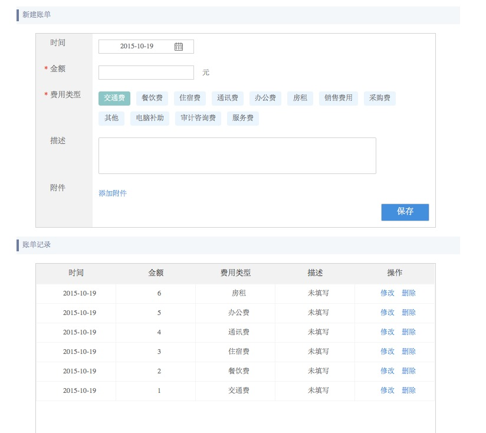

#前端组件间交互


*我们都提倡前端组件化，好处多多：代码复用，减少重复劳动；统一规范，不至于一个系统中同样是按钮，长的五花八门。

## 下面还是先看图



* 根据这张图，产品要求如下：
1. 上方保存或者修改后下方的数据需要同步更新。
1. 选中下方某一条的时候，上方需要显示该条数据的内容。

假定我们定义这个页面有两个组件 form list

```
var form = function(){
    init: function() {

    },
    render: function(data) {

    },
    saveHandler: function() {

    },
    updateHandler: function() {

    },
}

var list = function() {
    init: function() {

    },
    render: function() {

    },
    seelectHandler: function() {

    },
    refreshHandler: function() {

    },
    deleteHandler: function() {

    }
}

```

##目前的可实现的方案中，大概有三种。
*最差的一种，直接在组件内处理：


```
var form  = function() {
    init: function() {

    },
    render: function() {

    },
    saveHandler: function() {
        //ajax
        list.refreshHandler();
    },
    updateHandler: function() {
        //ajax
        list.refreshHandler();
    },
}

var list  = function() {
    init: function() {

    },
    render: function(data) {

    },
    seelectHandler: function() {
        var data = ...
        form.render(data);
    },
    refreshHandler: function() {

    },
    deleteHandler: function() {

    }
}

```
这个方案破坏了组件自身的封闭性，当一个组件同时被多个组件使用，且不在一个页面时，这种方式已经不适用了。


*中等可接受的一种，预留事件处理入口：


```
var form  = function() {
    init: function() {

    },
    render: function() {

    },
    saveHandler: function() {
        //ajax
        if(this.afterSavehandler){
            this.afterSavehandler()
        }
    },
    updateHandler: function() {
        //ajax
        if(this.afterUpdatehandler){
            this.afterUpdatehandler()
        }
    },
}

var list  = function() {
    init: function() {

    },
    render: function(data) {

    },
    seelectHandler: function() {
        var data = ...
        if(this.afterSelecthandler){
            this.afterSelecthandler(data)
        }
    },
    refreshHandler: function() {

    },
    deleteHandler: function() {

    }
}

使用时：
var formIns, listIns;

var afterSavehandler = function(){
    listIns.refreshHandler();
}

var afterUpdatehandler = function(){
    listIns.refreshHandler();
}

var afterSelecthandler = function(data){
    formIns.render(data);
}

formIns = new form({
    afterSavehandler: afterSavehandler,
    afterUpdatehandler: afterUpdatehandler,
});

listIns = new list({
    afterSelecthandler: afterSelecthandler,
})
```
这个方案相对于第一个方案，不存在强侵入性，组件自身的事件处理前后可以预留处理函数入口，使用组件时根据业务的需求进行定义。

