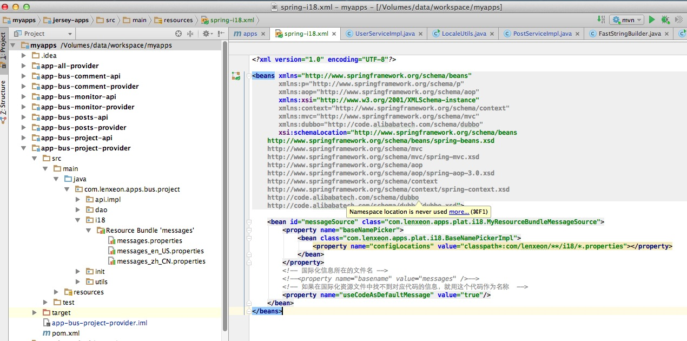
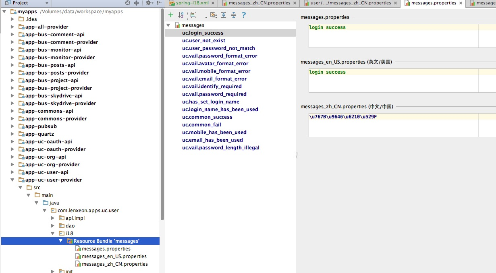

#多国语言方案在鱼骨中的应用

## 场景及问题
1. 项目mvn分模块后需要有一个方案能在实现国际化的同时，让各个模块的开发者可以自定自己的国际化提示
而不会影响到别人，所以国际化的提示信息应该配置到模块中，需要一个统一的管理规范

## 先看一下总体的效果

* xml的配置


* 每个模块具体的使用


## 具体实现

* 配置文件
``` xml
<?xml version="1.0" encoding="UTF-8"?>
<beans xmlns="http://www.springframework.org/schema/beans"
       xmlns:p="http://www.springframework.org/schema/p"
       xmlns:aop="http://www.springframework.org/schema/aop"
       xmlns:xsi="http://www.w3.org/2001/XMLSchema-instance"
       xmlns:context="http://www.springframework.org/schema/context"
       xmlns:mvc="http://www.springframework.org/schema/mvc"
       xmlns:dubbo="http://code.alibabatech.com/schema/dubbo"
       xsi:schemaLocation="http://www.springframework.org/schema/beans
    http://www.springframework.org/schema/beans/spring-beans.xsd
    http://www.springframework.org/schema/mvc
    http://www.springframework.org/schema/mvc/spring-mvc.xsd
    http://www.springframework.org/schema/aop
    http://www.springframework.org/schema/aop/spring-aop-3.0.xsd
    http://www.springframework.org/schema/context
    http://www.springframework.org/schema/context/spring-context.xsd
    http://code.alibabatech.com/schema/dubbo
    http://code.alibabatech.com/schema/dubbo/dubbo.xsd">

    <bean id="messageSource" class="com.lenxeon.apps.plat.i18.MyResourceBundleMessageSource">
        <property name="baseNamePicker">
            <bean class="com.lenxeon.apps.plat.i18.BaseNamePickerImpl">
                <property name="configLocations" value="classpath*:com/lenxeon/**/i18/*.properties"></property>
            </bean>
        </property>
        <!-- 国际化信息所在的文件名 -->
        <!--<property name="basename" value="messages" />-->
        <!-- 如果在国际化资源文件中找不到对应代码的信息，就用这个代码作为名称  -->
        <property name="useCodeAsDefaultMessage" value="true"/>
    </bean>
</beans>
```
> 上面的xml有两个重要的信息，
1.是自己字义了一个MyResourceBundleMessageSource，
2.是约定了所有包的configLocations的路径规范

* MyResourceBundleMessageSource

```java
package com.lenxeon.apps.plat.i18;

import org.springframework.beans.factory.InitializingBean;
import org.springframework.context.support.ReloadableResourceBundleMessageSource;


public class MyResourceBundleMessageSource extends ReloadableResourceBundleMessageSource implements InitializingBean {

    BaseNamePicker baseNamePicker;

    public BaseNamePicker getBaseNamePicker() {
        return baseNamePicker;
    }

    public void setBaseNamePicker(BaseNamePicker baseNamePicker) {
        this.baseNamePicker = baseNamePicker;
    }

    @Override
    public void afterPropertiesSet() throws Exception {
        super.setBasenames(baseNamePicker.pickBaseName());
    }
}

```


BaseNamePicker
```java
package com.lenxeon.apps.plat.i18;


public interface BaseNamePicker {

    public String[] pickBaseName() throws Exception;

}
```

* BaseNamePickerImpl
```java
package com.lenxeon.apps.plat.i18;


import org.apache.commons.lang.StringUtils;
import org.springframework.beans.factory.InitializingBean;
import org.springframework.core.io.Resource;
import org.springframework.core.io.support.PathMatchingResourcePatternResolver;

import java.util.ArrayList;
import java.util.List;

public class BaseNamePickerImpl implements BaseNamePicker, InitializingBean {


    private String[] configLocations;

    public String[] getConfigLocations() {
        return configLocations;
    }

    public void setConfigLocations(String[] configLocations) {
        this.configLocations = configLocations;
    }

    @Override
    public void afterPropertiesSet() throws Exception {

    }

    @Override
    public String[] pickBaseName() throws Exception {
        if (this.configLocations == null || this.configLocations.length < 1) {
            throw new RuntimeException("configLocations property of IBaseNameResolverImpl is require!");
        }
        PathMatchingResourcePatternResolver pathResolver = new PathMatchingResourcePatternResolver();
//        String rootPath = this.getClass().getClassLoader().getResource("//").toString();
//        System.out.println(Thread.currentThread().getContextClassLoader().getResource());
        System.out.println(Thread.currentThread().getContextClassLoader().getResource("/"));
        String rootPath = "";//Thread.currentThread().getContextClassLoader().getResource("//").toString();
        List<String> baseNameList = new ArrayList<String>();
        for (int i = 0; i < this.configLocations.length; i++) {
            Resource[] resources = pathResolver.getResources(configLocations[i].trim());
            if (resources != null) {
                System.out.println("=================================================");
                for (int j = 0; j < resources.length; j++) {
                    String uri = resources[j].getURI().toString();
                    String baseName = uri.replaceAll(rootPath, "");
                    baseName = StringUtils.substringBeforeLast(baseName, ".properties");
//                    baseName = StringUtils.substringAfter(baseName, "classes/");
//                    System.out.println(rootPath);
//                    System.out.println(uri);
//                    System.out.println(StringUtils.replace(uri, rootPath, ""));
                    System.out.println(baseName);
                    baseNameList.add(baseName);
                }
                System.out.println("=================================================");
            }
        }
        return baseNameList.toArray(new String[]{});
    }
}
```

* properties en_US 英文配置
```properties
uc.login_success=login success
uc.user_not_exist=user not exist
uc.user_password_not_match=user password not match
uc.vail.password_format_error=user password format error
uc.vail.avatar_format_error=user avatar format error
uc.vail.mobile_format_error=user mobile format error
uc.vail.email_format_error=user email format error
uc.vail.identify_required=identify required
uc.vail.password_required=password required
uc.has_set_login_name=user has set login name
uc.login_name_has_been_used=login name has benn used
uc.common_success=success
uc.common_fail=fail
uc.mobile_has_been_used=mobile has been used
uc.email_has_been_used=email has been used
uc.vail.password_length_illegal=password [${validatedValue}] length must between {min} and {max}
```

* properties zh_CN 中文配置
```properties
uc.login_success=\u767B\u9646\u6210\u529F
uc.user_not_exist=\u8D26\u6237\u4E0D\u5B58\u5728
uc.user_password_not_match=\u7528\u6237\u5BC6\u7801\u4E0D\u6B63\u786E
uc.vail.password_format_error=\u7528\u6237\u5BC6\u7801\u683C\u5F0F\u4E0D\u6B63\u786E
uc.vail.avatar_format_error=\u7528\u6237\u5934\u50CF\u5730\u5740\u683C\u5F0F\u4E0D\u6B63\u786E
uc.vail.mobile_format_error=\u7528\u6237\u624B\u673A\u683C\u5F0F\u4E0D\u6B63\u786E
uc.vail.email_format_error=\u7528\u6237\u90AE\u7BB1\u683C\u5F0F\u4E0D\u6B63\u786E
uc.vail.identify_required=\u7528\u6237\u6807\u8BC6\u4E0D\u80FD\u4E3A\u7A7A
uc.vail.password_required=\u7528\u6237\u5BC6\u7801\u4E0D\u80FD\u4E3A\u7A7A
uc.has_set_login_name=\u7528\u6237\u5DF2\u7ECF\u8BBE\u7F6E\u8FC7\u767B\u9646\u7528\u6237
uc.login_name_has_been_used=\u7528\u6237\u540D\u5DF2\u7ECF\u88AB\u4F7F\u7528
uc.common_success=\u6210\u529F
uc.common_fail=\u5931\u8D25
uc.mobile_has_been_used=\u624B\u673A\u53F7\u5DF2\u7ECF\u88AB\u4F7F\u7528
uc.email_has_been_used=\u90AE\u7BB1\u5DF2\u7ECF\u88AB\u4F7F\u7528
uc.vail.password_length_illegal=\u5BC6\u7801[${validatedValue}]\u957F\u5EA6\u5FC5\u987B\u5728${formatter.format("%04d", min)}\u5230{max}\u4E4B\u95F4${pageContext.request.requestURL}
```

* 封装的调用工具，主要是根据请求的header中的信息来决定获取哪国的message
```java
package com.lenxeon.apps.plat.utils;

import com.lenxeon.utils.str.FastStringBuilder;
import com.lenxeon.utils.str.StringFormat;
import org.apache.commons.lang.StringUtils;
import org.springframework.beans.factory.annotation.Autowired;
import org.springframework.context.MessageSource;
import org.springframework.stereotype.Component;
import org.springframework.web.context.request.RequestContextHolder;
import org.springframework.web.context.request.ServletRequestAttributes;

import javax.servlet.http.HttpServletRequest;
import java.util.Arrays;
import java.util.Locale;


@Component
public class LocaleUtils {

    @Autowired
    private MessageSource source;

    public Locale getLocal(HttpServletRequest request) {
        Locale locale = new Locale("en", "US");
        String loc = request.getParameter("locale");
        if (StringUtils.isNotBlank(loc)) {
            if (StringUtils.containsIgnoreCase(loc, "zh")) {
                locale = new Locale("zh", "CN");
            }
        } else {
            String locHeader = request.getHeader("Accept-Language");
            if (StringUtils.containsIgnoreCase(locHeader, "zh")) {
                locale = new Locale("zh", "CN");
            }
        }
        return locale;
    }

    public String getMessage(String key, Object... object) {
        Locale locale = null;
        try {
            HttpServletRequest request = ((ServletRequestAttributes) RequestContextHolder.getRequestAttributes()).getRequest();
            locale = getLocal(request);
        } catch (Exception ex) {

        }
        String message = source.getMessage(key, null, locale);
//        System.out.println(key + "\t" + locale.toString() + "\t" + Arrays.toString(object) + "\t" + message);
        return StringUtils.defaultString(message);
    }
}
```

* 业务中使用的示例代码片段
``` java

    @Autowired
    private LocaleUtils localeUtils;

    //示例代码片段
    comment.setCreator(user);
    int i = commentDao.save(comment);
    if (i != 1) {
        throw new IllegalArgumentException(localeUtils.getMessage("uc.common_fail"));
    }
```
