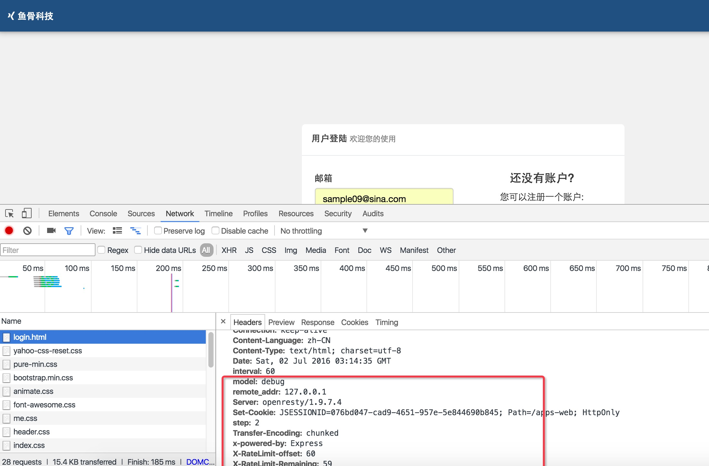

# lua openresty 访问控制策略

##场景##

  >今天接到boss提出的一个场景，由于企业软件场景需要，服务器升级需要暂停对外服务，
  同时内部员工要加紧正式服务器上的测试，这个时间段内外面的用户如果有访问还应该给一个友好的提示

##规划及思路:##

1. 因为服务器这段时间具有不确定性，因此不打算把这个服务交给应用去做，打外由nginx来处理
1. 区分内部员工和外部用户可以用ip地址来过滤（我们公司是有固定ip的）
1. 如果不满足ip条件的访问，给一个固定的提示信息


##先简单介绍一下我们公司应用的相关技术情况##

1. spring mvc + velocity 引擎渲染html，同时提供 /api/* 的json数据服务
1. openresty + 多台 tomcat 分布式服务
1. 缓存有redis + memcached

##具体实现##
nginx中的配置文件，主要贴了关于html和json的两段，看access_by_lua这两个控制点
```conf
#处理html
location ~* \.(html)$ {
    set $model debug;
    access_by_lua '
        local request = require "resty.rate.limit"
        request.limit { key = ngx.var.remote_addr,
                        rate = 60,
                        interval = 60,
                        log_level = ngx.NOTICE,
                        redis_config = { host = "127.0.0.1", port = 6379, timeout = 1, pool_size = 100 } }
    ';
    proxy_pass         http://tomcat;
    proxy_redirect     off;
    proxy_cookie_path   /apps-web/ "/";
    add_header model '$model';
    add_header remote_addr '$remote_addr';

    proxy_set_header   Host             $host;
    proxy_set_header   X-Real-IP        $remote_addr;
    proxy_set_header   X-Forwarded-For  $proxy_add_x_forwarded_for;
    proxy_set_header   Cookie $http_cookie;

    client_body_buffer_size    128k;

    proxy_connect_timeout      300;
    #proxy_send_timeout         300;
    proxy_read_timeout         300;

    proxy_buffer_size          4k;
    proxy_buffers              4 32k;
    proxy_busy_buffers_size    64k;
    proxy_temp_file_write_size 64k;
}

location ^~ /api/ {
    access_by_lua '
        local request = require "resty.rate.limit"
        request.limit { key = ngx.var.remote_addr,
                        rate = 60,
                        interval = 60,
                        log_level = ngx.NOTICE,
                        redis_config = { host = "127.0.0.1", port = 6379, timeout = 1, pool_size = 100 } }
    ';
    proxy_pass         http://tomcat;
    proxy_redirect     off;
    proxy_cookie_path   /apps-web/ "/";
    add_header debug 'api';

    proxy_set_header   Host             $host;
    proxy_set_header   X-Real-IP        $remote_addr;
    proxy_set_header   X-Forwarded-For  $proxy_add_x_forwarded_for;
    proxy_set_header   Cookie $http_cookie;

    client_body_buffer_size    128k;

    proxy_connect_timeout      300;
    #proxy_send_timeout         300;
    proxy_read_timeout         300;

    proxy_buffer_size          4k;
    proxy_buffers              4 32k;
    proxy_busy_buffers_size    64k;
    proxy_temp_file_write_size 64k;
}
```
lua代码，这个代码不仅提供了访问模式控制，还提供了访问频率控制

[lua 代码链接](https://github.com/lenxeon/lua_service/blob/master/lib/resty/rate/limit.lua)

##测试效果##

debug模式下本地访问，通过



debug模式下非本地访问，禁止

##TODO##
这里只是提供了一个可能，还可以更多的根据自己的业务定制策略，比如只允许某个参数=某值的通过(如：仅鱼骨公司可以访问，这样鱼骨公司的测试人员在家也能测试)
访问频率控制的目前以ip为策略，后期调整为以用户为策略
